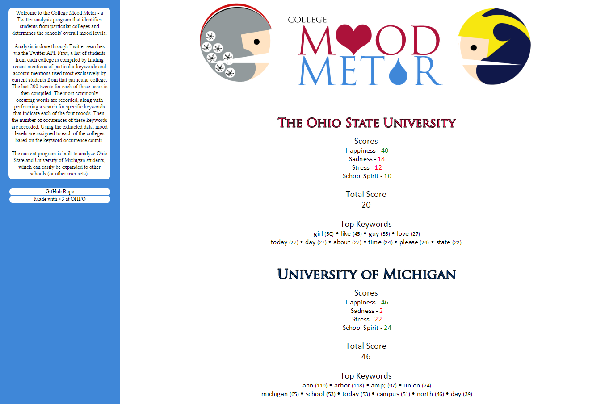

College Mood Meter
===============

Welcome to College Mood Meter: a Twitter analysis program that identifies students from particular colleges and determines the schools' overall mood levels in the following categories:

- Happiness
- Sadness
- Stress (midterm week, anyone?)
- School spirit

Analysis is done through Twitter searches via the Twitter API. Through a Python application, a list of students from each college is compiled by finding recent mentions of particular keywords and account mentions used most exclusively by the college's current students. From this user pool, 200 of each user's latest tweets are extracted and word counts are calculated. This data is then sent to a C# application in the form of raw text files, each line holding a word and the number of times it appears within the student subset.

In the C# application, the raw text data is sorted and the most commonly occuring words are recorded, along with performing a search and count for specific keywords that indicate each of the four moods previously specified. Using the extracted data, mood levels are assigned to each of the colleges based on keyword occurences. Happiness and school spirit are considered positive traits, while sadness and stress are considered negative. Adding and subtracting these values produces the final score.

The current program is built to analyze Ohio State and University of Michigan students, which can easily be expanded to other schools (or even other user sets).

## Final Result

## Team Members
- Kevin Payravi - C# (Data analysis and output)
    + The Ohio State University
    + Graduating 2017
    + Computer Science & Engineering
    + http://www.kevinpayravi.com/
- Ben Knisley - Python (API calls and data collection)
    + The Ohio State University
    + Graduating 2017
    + Computer Science & Engineering
- Eun-jai Kim - Frontend (Website design and graphics)
    + The Ohio State University
    + Graduating 2017
    + Computer Science & Engineering

## Identifying Students: Keywords and Mentions
### Ohio State University
`#BuckeyeNation` `@OhioUnion` `@OUAB` `@OSUCrush` `@BuckeyeCrushes` `@TBDBITL` `@FakeUrban` `@TheFakeLantern` `@Brutus_Buckeye`

### University of Michigan
`@UMichUnions` `@UmichStudents` `@umichband` `@MMBStudents` `@UMStudentlife` `@crushes_umich` `@UMichGreek`

## Mood Keywords
### Happiness
`<3` `:)` `:-)` `:]` `:D` `;)` `;]` `^^` `better` `easy` `ecstatic` `excited` `family` `friends` `fun` `funny` `glad` `good` `happiest` `happiness` `happy` `hilarious` `kind` `kindness` `laugh` `laughing` `lol` `love` `loving` `nice` `passed` `win` `winning` `xD` `yay` `yes`
### Sadness
`:(` `:-(` `:[` `;(` `bad` `crying` `D:` `depressed` `depressing` `depression` `disgust` `disgusting` `Dx` `enemies` `fat` `fml` `gross` `hard` `hate` `idiot` `impolite` `judgement` `lose` `miserable` `miss` `mistake` `rude` `sad` `saddening` `saddest` `sadness` `shitty` `sick` `sin` `stupid` `suck` `sucks` `useless` `worst` `worthless`
### Stress
`2am` `could've` `exam` `exams` `fail` `failed` `failure` `finals` `help` `homework` `job` `late` `midterm` `midterms` `money` `more` `procrastinate` `procrastination` `regret` `should've` `stress` `stressed` `stressed` `stressing` `studying` `wish` `out`
### Spirit Levels
`bestcollege` `coolestcollege` `football` `gameday` `gored` `undefeated`
#### Ohio State University Exclusive
`brutus` `buckeye` `buckeyebrutus` `gobucks` `goosu` `iloveosu` `loveosu` `osufootball` `scarletandgray` `scarletandgrey`
#### University of Michigan Exclusive
`biff` `chadtough` `gobigblue` `goblue` `gomichigan` `wolverine` `wolverines`
## Disclaimer
While this application is intended to give interesting insights and trends, the results of this analysis are not scientific. While a minority, some users identified as current students may be false positives, and the keywords used to gauge mood levels are not free from selection bias.
